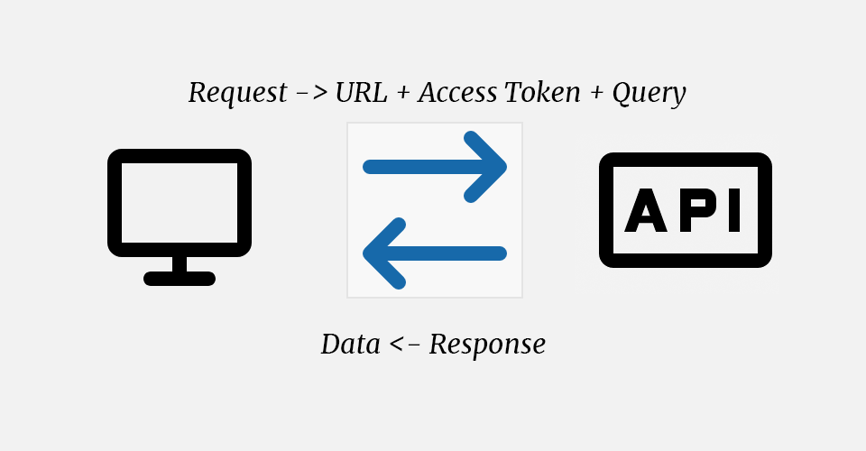
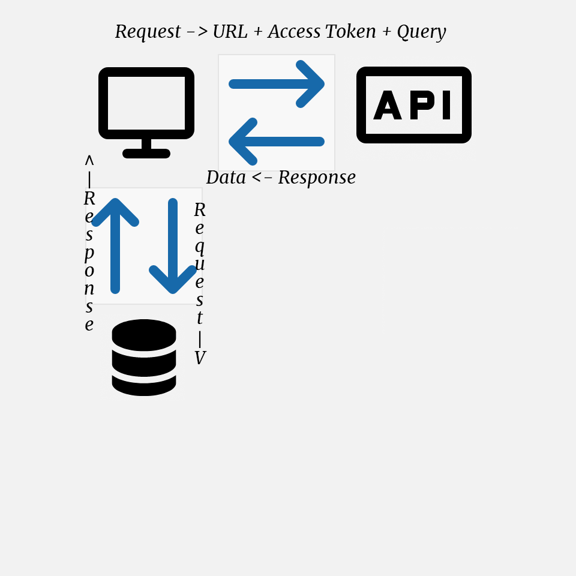
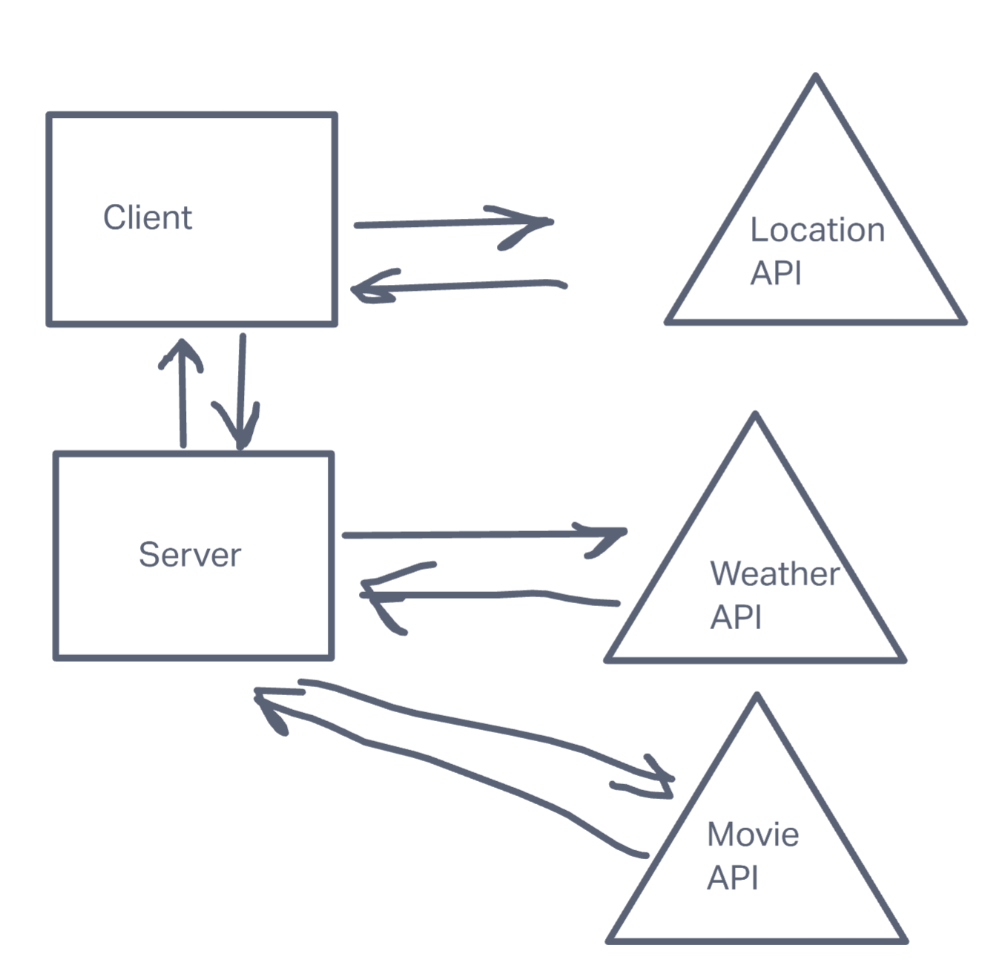
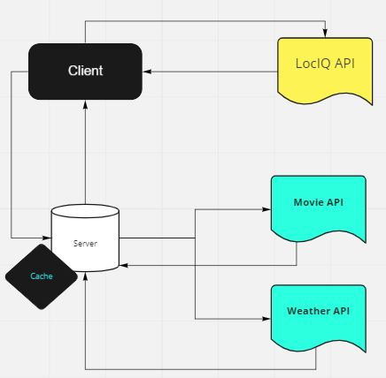

# city-api - Custom Servers with Node and Express

**Author**: YTyler Egashira
**Version**: 1.0.0 (increment the patch/fix version number if you make more commits past your first submission)

## Overview

A server for my city-explorer application

## Getting Started

After cloning  do not forget to `npm i`

## Architecture

[Node.js v16.14.2](https://nodejs.org/en/),
[npm v8.3.2](https://docs.npmjs.com/)
[expressJS](http://expressjs.com/en/4x/api.html)

## Change Log

3-22-2022 12:25PM - Application now has a fully-functional express server

3-24-2022 12:25PM - Server has been refactored. 

3-25-2022 4:15PM - 

## Credit and Collaborations

Benjamin Carter -> Thanks for troubleshooting with me. 

## Time Estimates

Name of feature: Server.js

Estimate of time needed to complete: 2 hrs

Start time: 2:00pm

Finish time: 3:15PM

Actual time needed to complete: 1hr 15min

---

Name of feature: Front end modal for weather

Estimate of time needed to complete: 35 min

Start time: 3:15pm

Finish time: 5:20pm

Actual time needed to complete: 2hr 5 min

---

Name of feature: Error Handling

Estimate of time needed to complete: 20 min

Start time: 5:20pm

Finish time: 7:00pm (I made dinner during)

Actual time needed to complete: ???
